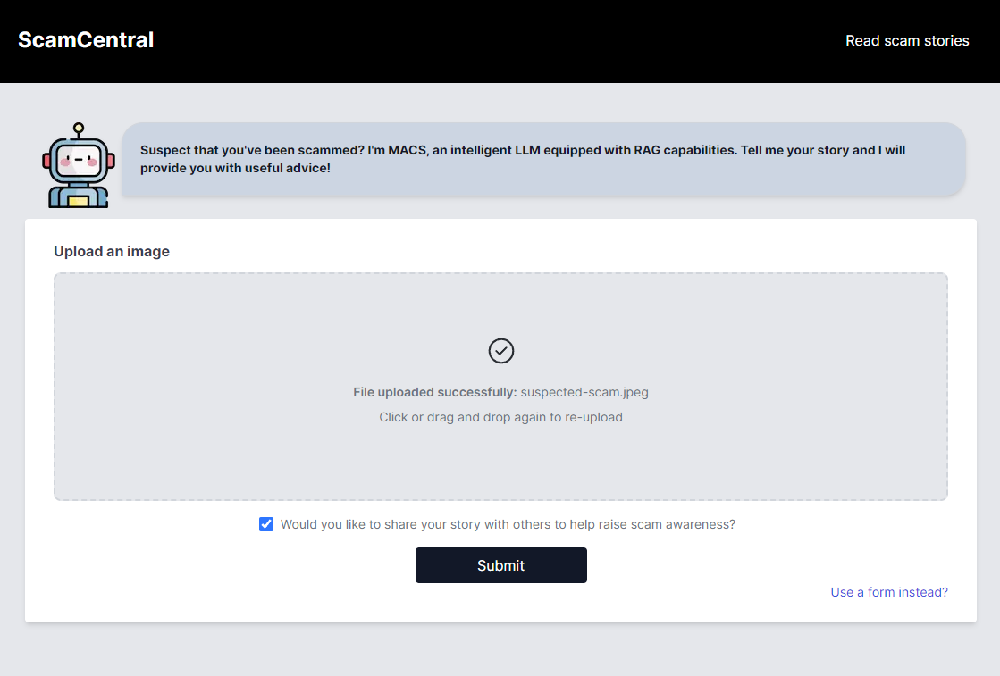

<div align = "center">
<h1> 🐸 ScamCentral</h1>
</div>

## 👉 Theme 1 - Digital Threats
#### 👉 Subtheme 1: Tackling Financial Frauds
With the escalating threat of financial frauds posing a significant challenge to individuals and businesses, it have resulted in numerous financial and emotional damage caused by bank scams. Therefore, to combat against the rising threat of bank scams and protect individuals and businesses, we are here to develop a comprehensive solution that overcomes limitations in public awareness, legal frameworks, and the adaptability of fraudsters. 

## 🌍 About
**To combat against the rising threat of bank scams:**

**ScamCentral** is an innovative web application that leverages on latest AI technologies to analyse text or conversation images for scam detection, allowing users to interact with the system for real-time updates. 

Leveraging on the latest AI technologies to analyse uploaded conversation images or text description for scam detection, offering accurate replies and suggestions to users. Using cutting-edge technlogies such as GPT-Vision, GPT-4, the platform extract and analyses conversation flows, converting them into JSON format for further evaluation. 

An innovative scoring system, powered by LangChain Large Language Model (LLM) equipped with a knowledge base will aid in evaluating the scam likelihood, with the integration of a vector databse for enhanced accuracy through similarity search. The Large Language Model will provide real-time feedback to users which include crucial information such as AI-determined scam score, explanation and suggestions to prevent being caught in a Scam trap. 

## 🚀 A Multi-Pronged Approach to Bank Scam Prevention
### 1. 🔎 Upload Text Description of Scam 
Users will need to input Scam Source (Phone number, email address, and website URL), Where did you encounter the scam? (e.g. Email, Phone call, SMS ) as well as the Description of Scam. 


After filling up the form, you will just need to click on the submit button. Receive a customised report on the scam risk level determined and our suggestions based on our AI model.


### 2. 🔎 Upload Image Description of Scam
Users will simply upload images of the Message or conversation and click on the submit button. 
Receive a customised report on the scam risk level determined and our suggestions based on our AI model.



### 3. 🔎 Read Scam Stories
Visit our personalised curated Scam Stories Page to view ALL the Scam Stories that were previously updated by other users or curated by us. You will be able to read through all the Scam Stories and gain knowledge all the suggestions and advice provided by our AI model. 


#### 📃 How does it help with our problem?
1. Empowering the Public: Customised Scam Reports & User
- By allowing users to report and upload scam descriptions, we can create personalized reports that help individuals easily identify and avoid bank scams. This is especially crucial for vulnerable groups like elderly, who can access the information through a simple and user-friendly interface.
2. Building Awareness & Knowledge: Personalised Tips for Continuous Learning
- We go beyond just identifying scams. Our platform provides personalized suggestions and educational resources to help users understand and combat against bank scams, such as ransomware. This fosters public awareness and empowers individuals to protect themselves.
3. Real-Time Insights & Collaborative Aiding
- By allowing users to share their experiences, our AI model continuously learns and adapts to identify even the most sophisticated and evolving scam tactics. This real-time data also provides valuable insights for authorities, enabling them to develop effective strategies and minimize the damage caused by bank scams.

## 📌 Technical Stack
<h2> 🤖 FrontEnd </h2>


<h2>🤖 BackEnd</h2>


<h2>🤖 Database </h2>


## 🗺️ Our Tech Approach using Artificial Intelligence
### 🚂 Large Language Models 
- GPT-4o: GPT-4o is equipped with capabilities that accepts inputs of any combination such as text, audio and image outputs. We uses both the text and image as input to predict and analyse Scam descriptions. 
- GPT-4-Turbo & GPT-3.5: Processes the extracted conversation content and analyse the conversation to predict and determine the likelihood of being a Scam. 

### 🚂 AI Scoring and Database
- LangChain: LangChain is a framework that helps in evaluate and analyse conversation for scam likelihood. Building a Retrieval Augmented Generation (RAG) to provide the Large Language Model a knowledge base for enhanced accuracy. 
- Chroma: Uses Chroma as a vector-database to allow us to store data and aid in similarity search for retrieval of similar data. 

## 🛫 Approach
### 🛫 Prompt Engineering
Prompt engineering refers to the art and science of the design of prompts for LLMs to produce high-quality, coherent outputs. This is a crucial aspect of working with LLMs, as the quality of the prompt can greatly affect the quality of the generated text. 

### 🛫 Zero-Shot Learning
Zero-Shot Prompting is where you directly pose a question type of machine learning without giving it any examples. 
For example: 
Prompt: 
```
Classify the following message into High, Medium, Low Likelihood of it being a Scam Message. 
Text: Congratulations! You've won a $1000 Walmart gift card. Go to http://bit.ly/123456 tp claim now.
Likelihood of Scam: 
```
Output: 
```
The likelihood of scam is High. 
```

Note that in this prompt, we did not provide the model with any example or context, however, it was proved that LLM was able to understand the task and classify it correctly. 

However, we realised that while Zero-Shot Prompting was able to provide us with an accurate result, at times it will result in hallucinations. Hence, we wanted to further prompt it to attain a better accuracy of the results. 

### 🛫 Few-Shot Learning
Few-Shot Learning is where one provide multiple examples to the AI model, and it is able to generalise to new example of what is needed. 
For example: 
Prompt: 
```
Classify the following message into High, Medium, Low Likelihood of it being a Scam Message. 
Text: "I am happy"
Likelihood of Scam: Low

Text: "I was purchasing flight tickets to stockholm and used my trust card for payment. During this transaction, I received a push notification on my trust app asking me to approve payment 'Pending payment for SQ321 SIN to ARN. Was this you?'. I cancelled the transaction and decided to purchase the flight tickets some other time"
Likelihood of Scam: Medium

Text: "Hi Sara! It's Malcolm. Sharing my new number with you.\nHey! Got it, thanks for sharing. What’s up?\nI got into an accident on my bicycle going to work today. Can you help me cover some of my aftercare medication costs? I need 150$ right now.\n😧😧 Omg, M! where are you? Yes, I can send some money in the next hour."
Likelihood of Scam: High

Text: Congratulations! You've won a $1000 Walmart gift card. Go to http://bit.ly/123456 tp claim now.
Likelihood of Scam: 
```
Output: 
```
High
```

Hence, we see that once we have shown the AI how should the response be like, and how it should look like, AI is able to emulate it pretty well. 

Therefore, Few-shots learning is a very powerful way to control how you want the response of the AI to be like. 

### 🛫 Hallucination Problems
However, we are still faced with hallucination problems. Hallucinations problem arises when Large Language Models (LLMs) generate text that appears coherent and contextually relevant but is factually incorrect or misleading. Hence, to mitigate hallucination, we want to provide the LLM model with a set of knowledge base. 

### 🛫 Few-Shot Learning with Retrieval Augmented Generation (RAG)

Retrieval Augmented Generation (RAG) is emerging as a crucial framework to utilize LLMs in an optimal and efficient manner. RAG enables the dynamic integration of external knowledge sources, enhancing the accuracy and relevance of responses generated by these applications. 

RAG involves searching across a vast corpus of private data and retrieving results that are most similar to the query asked y the user so that it can be passed on to the LLM as context. This approach will allow LLM to better understand the user's query and its context, leading to more accurate and pertinent responses, and reducing hallucinations. 

#### 🛫 Steps in RAG

1. Document Loading
- In the initial step, relevant documents are ingested and prepared for further processing. So, in this case, we are using CSVLoader from LangChain to load the pre-processed CSV Data. 
2. Splitting & Chunking
- The text from the documents is then split into smaller chunks and segments. The chunks are segmented into chunk_size of 1000 and chunk_overlap of 200. These chunks will serve as the building blocks for subsequent stages. 
3. Storage
- Following the splits and chunking, the embeddings embedded using OpenAIEmbeddings() will will be created and stored in a vectorstore of ChromaDB. These embeddings capture the semantic meaning of the text. 
4. Retrieval 
- When an online query arrives, the system will retrieves relevant chunks from the vector store based on the inputted query. This retrieval step ensures that the system identifies the most pertinent information. 
5. Generate Output 
- Finally, the retrieved chunks are used to generate a coherent response. This output can be in the form of text. 

## Conclusion 
In conclusion, ScamCentral provides and presents a novel approach in combating the growing problem of Bank Scams. By harnessing the power of cutting-edge AI technologies like GPT4-Vision, GPT-4 and LangChain LLM, it offers users a comprehensive solution for real-time scam detection and prevention. Hence, this web application has the potential to significantly enhance online security and financial safety for individuals and organisations. 

## Contributors
| Contributors | Roles |
| ---------| -----:|
| `Nicholas Seah` | Hacker & Hipster |
| `Bryan Lim` | Hacker & Hustler |
| `Lim Ke En` | Hacker & Hustler|
| `SayHong` | Hacker & Hipster |


